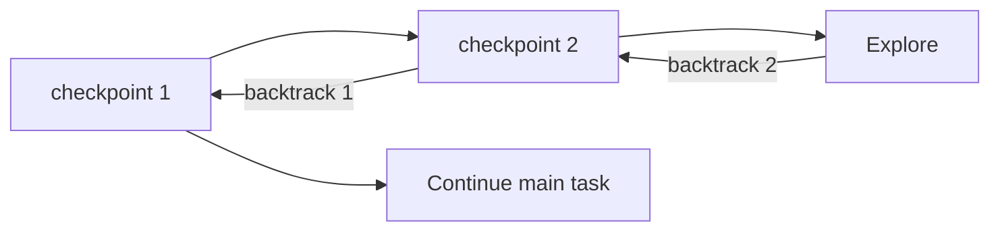

# pi-backtrack

Agent-controlled context for recursive thinking and exploration.

**English** · [简体中文](README.zh-CN.md)



## How it works

Injects a checkpoint and context usage after each user input and complete tool-result batch:

```text
[checkpoint 3 | context 48K/200K 24%]
```

The agent selects a return point based on task progress and context usage. Backtracking preserves the effective context through that checkpoint, replaces subsequent tool activity with tiered dialogue history and a handoff, then continues automatically.

```text
before  prefix → checkpoint → exploration
 after  prefix → checkpoint → dialogue + handoff → continue
```

- Context usage is a token estimate.
- Backtrack makes no extra summarizer call.
- Raw session history is preserved. No branching, file rollback, or external-action rollback.
- Ordinary backtracks continue numbering. Returning to `0` rebuilds from the fixed starting point and restarts numbering.

## Tool

```js
backtrack({
  checkpoint: 1,
  message: "Read the pool implementation and added diagnostics. Ruled out the pool; increasing its size did not help. Keep the diagnostic changes and inspect retry logic next."
})
```

`checkpoint` selects the return point. `message` records work done, material examined, findings, failed attempts and lessons, and next steps. Call the tool alone in its batch.

## Install

Requires a Pi 0.85.1-compatible environment. Node.js 22.19+ or 24+ is recommended.

Recommended: install with [pi-dynamic-skill](https://github.com/wjfjfm/pi-dynamic-skill).

```sh
pi install git:github.com/wjfjfm/pi-backtrack
pi install git:github.com/wjfjfm/pi-dynamic-skill
```

Run `/reload` or start a new session. Backtrack also works independently; install only the first package.

<details>
<summary>Run locally</summary>

```sh
git clone https://github.com/wjfjfm/pi-backtrack.git
cd pi-backtrack
npm ci
pi -e ./src/index.ts -e ./node_modules/pi-dynamic-skill/src/index.ts
```

Omit the second `-e` to run backtrack alone. Do not load another copy of dynamic-skill if it is already enabled globally.

</details>

## dynamic-skill

Backtrack manages current context. Dynamic-skill manages file-backed knowledge.

```text
explore → write/edit SKILL.md → backtrack → read SKILL.md when needed
```

- With both enabled, the agent receives guidance to save knowledge before backtracking.
- Successful backtracking settles skill accesses, manages active skills via LRU, and appends names, descriptions, and paths not already visible.
- Skill bodies are read on demand. Keep critical findings in the handoff, or specify which skill to read.
- `/dynamic-skill` supports manual selection: Tab switches LRU/All, Space toggles, Enter applies. Additions appear on the next model turn; removals settle at the next backtrack, compact, or reload.
- Skill files are reusable across sessions; LRU state belongs to the current session. Eviction never deletes files.

## Design reference

- [Design & implementation](docs/design.md): checkpoints, context projection, tiered history, backtrack transactions, and SDK adaptation.
- [pi-dynamic-skill](https://github.com/wjfjfm/pi-dynamic-skill): skill trees, LRU, and on-demand loading.
- [Dependency snapshot](vendor/README.md): companion version and update procedure.
