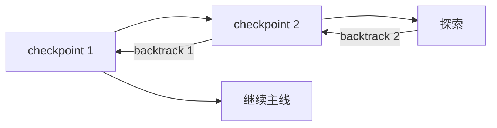

# pi-backtrack

让Agent自主控制上下文，完成递归的思考和探索

[English](README.md) · **简体中文**



## 原理

在 user input 和完整 tool result 批次后注入 checkpoint 与上下文用量：

```text
[checkpoint 3 | context 48K/200K 24%]
```

Agent 根据任务进度和上下文状态选择回退位点。回退保留目标 checkpoint 及之前的有效上下文，将后续工具过程替换为分层对话历史和交接信息，然后自动续跑。

```text
before  prefix → checkpoint → exploration
 after  prefix → checkpoint → dialogue + handoff → continue
```

- 上下文用量为 token 估算。
- backtrack 不额外调用模型生成摘要。
- 原始 session 历史保留，不切换分支，不回滚文件或外部操作。
- 普通回退延续编号；回退到 `0` 从固定起点重建，编号重新开始。

## 工具

```js
backtrack({
  checkpoint: 1,
  message: "已读连接池实现并添加诊断，排除连接池瓶颈；扩容无效。保留诊断改动，接下来检查重试逻辑。"
})
```

`checkpoint` 指定返回位点。`message` 记录已做工作、查阅内容、结论、试错教训和下一步。工具须独占调用批次。

## 安装

需要 Pi 0.85.1 兼容环境，建议 Node.js 22.19+ 或 24+。

推荐同时安装 [pi-dynamic-skill](https://github.com/wjfjfm/pi-dynamic-skill)：

```sh
pi install git:github.com/wjfjfm/pi-backtrack
pi install git:github.com/wjfjfm/pi-dynamic-skill
```

执行 `/reload` 或启动新会话。backtrack 可独立使用，只需安装第一项。

<details>
<summary>本地运行</summary>

```sh
git clone https://github.com/wjfjfm/pi-backtrack.git
cd pi-backtrack
npm ci
pi -e ./src/index.ts -e ./node_modules/pi-dynamic-skill/src/index.ts
```

仅运行 backtrack 时去掉第二个 `-e`。若已全局启用 dynamic-skill，不要重复加载。

</details>

## dynamic-skill

backtrack 管理当前上下文，dynamic-skill 管理文件化知识。

```text
explore → write/edit SKILL.md → backtrack → read SKILL.md when needed
```

- 同时启用后，Agent 会收到回退前保存知识的指引。
- 成功回退结算技能访问，按 LRU 管理活跃技能，追加尚未可见的名称、描述和路径。
- 技能正文按需读取。交接信息应保留关键结论，或指明需要读取的 skill。
- `/dynamic-skill` 支持手选：Tab 切换 LRU/All，Space 勾选，Enter 应用。新增项下一模型 turn 注入；取消项在下次 backtrack、compact 或 reload 结算时移出队列。
- 技能文件可跨会话复用；LRU 状态属于当前会话。淘汰不删除文件。

## Design reference

- [设计与实现](docs/design.md)：checkpoint、上下文投影、分层历史、回退事务与 SDK 适配。
- [pi-dynamic-skill](https://github.com/wjfjfm/pi-dynamic-skill)：技能树、LRU 与按需加载。
- [依赖快照](vendor/README.md)：配套版本与更新方法。
